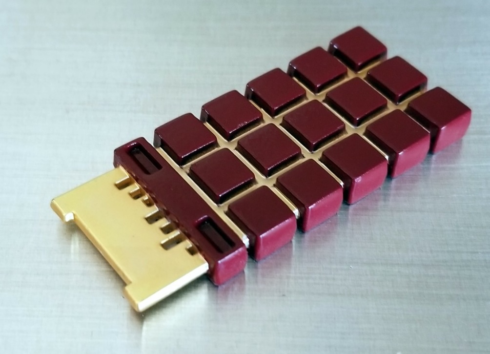

# Neural Net CPU

A tiny company building the ultimate neural network AI processor




## The plan

What do you need to build a neural network AI processor?

### technology node

Select a integrated circuit technology node from [MOSIS](https://www.mosis2.com) MPW, for example GlobalFoundries Bulk CMOS 28nm.

### libraries

Will need a foundry design kit and a library of circuit components cells.

### design tools

Open source tools as in [Zero-ASIC](https://www.zeroasic.com).

[Silicon Compiler](https://www.zeroasic.com/siliconcompiler) and its [github repo](https://github.com/siliconcompiler/siliconcompiler) and its [documentation](https://docs.siliconcompiler.com/en/latest/).


### architecture

See folder `architecture/`

### software

See folder `software/`

### extras

TBD


## Installation

### Silicon tools

Install [Yosis](https://github.com/YosysHQ/yosys).

Install Silicon Compiler:
```
pip install siliconcompiler
```


## Examples

### multi-layer perceptron network

Compile example:

```
python3 architecture/compile.py
```


# Acknowledgements

Eugenio Culurciello, all rights reserved 2026
